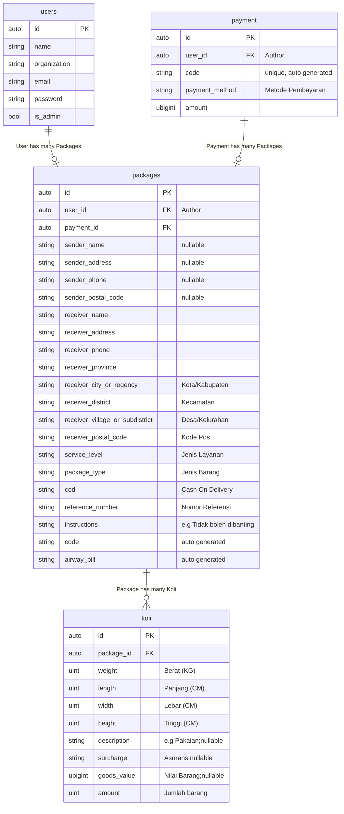

# Aplikasi Mile Pos

- PHP 8.2
- MySQL

## Installation

1. `composer install`
2. configure `.env`
3. `php artisan key:generate`
4. `php artisan migrate:refresh --seed`
5. `php artisan storage:link`

### Development

1. `php artisan db:seed --class=FakeSeeder`

### Admin

/admin

- email: admin@localhost
- password: admin

# ERD

